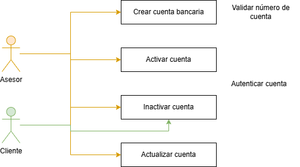
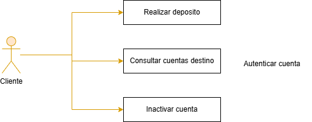
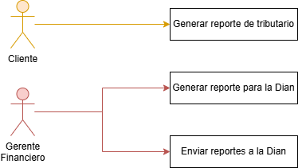

# 📄 Requerimientos del Sistema

## 1. Lista general de requerimientos

El sistema de Bankify tiene los siguientes requerimientos (descripción a alto nivel):

### 1.1 Requerimientos funcionales

El sistema de Bankify debe tener la capacidad de:

1. Autenticar usuarios (clientes, asesores, supervisores y gerente financiero) mediante usuario y contraseña.
2. Gestionar cuentas bancarias: crear, activar, inactivar y actualizar, validando las reglas de negocio definidas.
3. Gestionar la información de los clientes: crear, activar, inactivar y actualizar, según el rol autorizado.
4. Realizar depósitos de dinero a cuentas bancarias activas, por parte del cliente propietario u otros usuarios. [Mockup](https://sting-chart-71507952.figma.site/)
5. Consultar el saldo disponible de una cuenta bancaria por parte del cliente.
6. Generar el reporte tributario de declaración de renta individual del cliente en formato PDF.
7. Generar y enviar el reporte tributario de todas las cuentas a la DIAN en formato JSON, por parte del gerente financiero.
8. Validar que el número de cuenta tenga exactamente 10 dígitos numéricos sin caracteres especiales.
9. Validar que los dos primeros dígitos del número de cuenta correspondan a un banco registrado en el sistema.

### 1.2 Requerimientos no funcionales

El sistema de Bankify debe tener:

1. **Seguridad:** Las contraseñas deben almacenarse cifradas (hashing) y todas las comunicaciones deben realizarse mediante HTTPS.
2. **Disponibilidad:** El sistema debe estar disponible al menos el 99.5% del tiempo mensual.
3. **Rendimiento:** El sistema debe responder a consultas de saldo y depósitos en un tiempo máximo de 2 segundos bajo condiciones normales de carga.
4. **Usabilidad:** La interfaz debe ser intuitiva y permitir completar un depósito en máximo 3 pasos sin conocimientos técnicos previos.
5. **Trazabilidad:** El sistema debe registrar logs de todas las operaciones financieras con marca de tiempo, usuario y tipo de operación.
6. **Escalabilidad:** El sistema debe soportar un crecimiento del 200% en usuarios sin degradación significativa del rendimiento.
7. **Mantenibilidad:** El código debe seguir buenas prácticas de desarrollo y tener una cobertura mínima de pruebas del 70%.

---

## 2. Diagramas de caso de uso

### 2.1 Requerimiento Funcional 1

| Campo | Descripción |
|------|-------------|
| **ID** | RF-01 |
| **Nombre del requerimiento** | Gestión de Cuentas Bancarias |
| **Descripción** | El sistema debe permitir crear, activar, inactivar y actualizar cuentas bancarias, garantizando que cada cuenta cumpla con las reglas de negocio: número de 10 dígitos numéricos y banco registrado en el sistema. |
| **Precondiciones** | Para que el sistema cumpla con este requerimiento, Bankify debe tener previamente registrados los bancos válidos del sistema, y el usuario debe estar autenticado con un rol autorizado (asesor o cliente). |
| **Actor** | Asesor (crear, activar, inactivar, actualizar) — Cliente (solo inactivar su propia cuenta) |
| **Flujo principal** | 1. El asesor inicia sesión en el sistema. 2. El asesor accede al módulo de gestión de cuentas y selecciona "Crear cuenta". 3. El asesor ingresa el número de cuenta, tipo de cuenta y datos del cliente asociado. 4. El sistema valida que el número de cuenta tenga exactamente 10 dígitos numéricos. 5. El sistema valida que los dos primeros dígitos correspondan a un banco registrado. 6. El sistema registra la cuenta con estado "Activa" y muestra confirmación de la operación. |
| **Diagrama de caso de uso** |  |
| **Poscondiciones** | Se espera como resultado que la cuenta quede registrada en el sistema con estado "Activa", asociada al cliente y al banco correspondiente, lista para operar. |

---

### 2.2 Requerimiento Funcional 2

| Campo | Descripción |
|------|-------------|
| **ID** | RF-02 |
| **Nombre del requerimiento** | Realizar Depósito a una Cuenta |
| **Descripción** | El sistema debe permitir realizar depósitos de dinero a una cuenta bancaria activa, ya sea por el cliente propietario de la cuenta u otros usuarios autenticados en el sistema. |
| **Precondiciones** | Para que el sistema cumpla con este requerimiento, Bankify debe tener previamente registrada la cuenta destino en estado "Activa", y el usuario que realiza el depósito debe estar autenticado en el sistema. |
| **Actor** | Cliente propietario de la cuenta — Otro usuario autenticado |
| **Flujo principal** | 1. El usuario inicia sesión en el sistema. 2. El usuario accede a la opción "Realizar depósito" e ingresa el número de cuenta destino y el monto. 3. El sistema verifica que la cuenta destino exista y se encuentre en estado "Activa". 4. El sistema verifica que el monto ingresado sea un valor numérico positivo mayor a cero. 5. El sistema actualiza el saldo de la cuenta sumando el monto depositado. 6. El sistema registra la transacción con fecha, hora, monto y usuario, y muestra confirmación del depósito. |
| **Diagrama de caso de uso** |  |
| **Poscondiciones** | Se espera como resultado que el saldo de la cuenta destino se haya incrementado con el monto depositado y que la transacción quede registrada en el historial del sistema. |

---

### 2.3 Requerimiento Funcional 3

| Campo | Descripción |
|------|-------------|
| **ID** | RF-03 |
| **Nombre del requerimiento** | Generar Reporte Tributario de Declaración de Renta |
| **Descripción** | El sistema debe permitir generar reportes tributarios de declaración de renta: en formato PDF para el cliente individual, y en formato JSON para ser enviado a la DIAN por parte del gerente financiero con los datos de todas las cuentas. |
| **Precondiciones** | Para que el sistema cumpla con este requerimiento, Bankify debe tener previamente registrados los movimientos y saldos de las cuentas en el periodo fiscal a reportar, y el usuario debe estar autenticado con el rol correspondiente (cliente o gerente financiero). |
| **Actor** | Cliente (reporte PDF individual) — Gerente Financiero (reporte JSON para la DIAN) |
| **Flujo principal** | 1. El actor inicia sesión en el sistema con su rol correspondiente. 2. El actor accede a la opción "Generar reporte tributario". 3. El sistema recopila los datos de movimientos, saldos e intereses del periodo fiscal asociados al actor. 4. El sistema genera el documento en el formato correspondiente: PDF para el cliente o JSON para el gerente financiero. 5. El cliente descarga su reporte PDF; el gerente financiero confirma el envío del JSON a la DIAN. 6. El sistema confirma la generación y/o envío exitoso del reporte. |
| **Diagrama de caso de uso** |  |
| **Poscondiciones** | Se espera como resultado que el cliente tenga disponible su reporte de declaración de renta en PDF, y que la DIAN haya recibido el reporte JSON con la información tributaria de todas las cuentas del sistema. |

---

## 3. Preguntas

### a. ¿Identifica algún requerimiento que deba detallarse más? ¿cuál(es)?

Sí. El requerimiento **RF-03 (Reporte JSON para la DIAN)** requiere mayor nivel de detalle, ya que no se especifica la estructura exacta del JSON, los campos obligatorios exigidos por la DIAN, el periodo fiscal de referencia ni el mecanismo de envío (API REST, correo electrónico, portal web). Sin esta información resulta imposible implementarlo correctamente y garantizar el cumplimiento de las normas tributarias colombianas vigentes.

Adicionalmente, **RF-01 (Autenticación)** necesita más detalle respecto al manejo de sesiones, número máximo de intentos fallidos, bloqueo de cuentas, recuperación de contraseña y políticas de expiración de sesión, aspectos críticos para la seguridad de un sistema financiero.

### b. ¿Existen requerimientos que se contradigan entre sí? ¿cuál(es)?

Existe una tensión entre **RF-01 (Gestión de Cuentas)** y **RF-02 (Depósito)**. El primero establece que el cliente solo puede *inactivar* su cuenta, sin posibilidad de crearla ni modificarla. Sin embargo, RF-02 indica que "cualquier usuario" puede realizar depósitos a cualquier cuenta activa, sin especificar restricciones por rol. Esto genera ambigüedad: ¿puede un asesor realizar depósitos? ¿puede un cliente depositar a la cuenta de otro cliente? Es necesario definir con precisión los permisos por rol para las operaciones financieras.

### c. Si tuviera que dar una prioridad a los requerimientos, ¿cuáles deberían ser los 2 más importantes que deberían implementarse en una primera iteración del proyecto?

1. **Autenticación de usuarios:** Es el requisito base de toda la plataforma. Sin un mecanismo de autenticación seguro no es posible habilitar ninguna funcionalidad de forma controlada ni garantizar que cada actor acceda únicamente a las operaciones que le corresponden por su rol.

2. **Gestión de Cuentas Bancarias (RF-01):** Es el núcleo del modelo de negocio de Bankify. Sin cuentas registradas y debidamente validadas no es posible consultar saldos, realizar depósitos ni generar reportes. Todas las demás funcionalidades dependen de que este módulo esté operativo.

### d. ¿Existe algún requerimiento que no debería realizarse?

En el contexto del MVP de Bankify, el envío automático del **reporte JSON a la DIAN (RF-03, variante gerente financiero)** podría postergarse para una segunda iteración. Su implementación depende de la especificación técnica oficial de la DIAN, que requiere homologación con entidades externas y pruebas en ambientes controlados. Desarrollarlo prematuramente, sin los requisitos técnicos completos, podría generar reprocesos costosos. Se recomienda priorizar la generación del contenido del reporte y diferir la integración de envío automático a la DIAN para una iteración posterior una vez el núcleo del sistema esté estable.