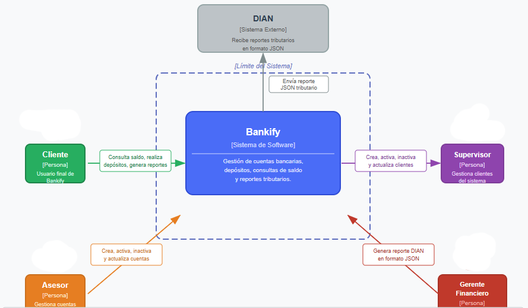

# 📄 Alcance del Sistema

## 1. Sistema

* **Nombre del sistema:** Bankify
* **Objetivo:** El sistema tiene como objetivo proporcionar una plataforma centralizada para la gestión básica de cuentas bancarias, permitiendo a los clientes consultar saldos, realizar depósitos y generar reportes tributarios, mientras garantiza el cumplimiento de las reglas de negocio definidas por Bankify para la validación de cuentas y la interacción segura entre los distintos roles del sistema.

---

## 2. Problema a resolver

Actualmente, Bankify no cuenta con un sistema centralizado que permita gestionar las cuentas bancarias de sus clientes de forma validada y segura. Esto implica que no existe un mecanismo formal para registrar cuentas con reglas de negocio definidas (como la validación del número de cuenta de 10 dígitos y la verificación del banco asociado), ni para permitir que los clientes consulten su saldo o realicen depósitos de manera controlada. Tampoco existe una forma estructurada de generar reportes tributarios de declaración de renta para los clientes en formato PDF, ni de enviar dichos reportes a la DIAN en formato JSON. La ausencia de este sistema representa un riesgo operativo y regulatorio para la startup, además de limitar su capacidad de escalar a servicios financieros más complejos.

---

## 3. Diagrama de Contexto

### 3.1 Diagrama

### 3.2 Actores

| Actor / Rol         | Descripción                                                                                      |
|---------------------|:------------------------------------------------------------------------------------------------:|
| Cliente             | Usuario final de Bankify. Puede consultar saldo, realizar depósitos y generar reportes de renta. |
| Asesor              | Empleado de Bankify con permisos para crear, activar, inactivar y actualizar cuentas bancarias.  |
| Supervisor          | Rol autorizado para crear, activar, inactivar y actualizar la información de los clientes.       |
| Gerente Financiero  | Responsable de generar el reporte tributario de todas las cuentas para enviarlo a la DIAN.       |

### 3.3 Sistemas externos

| Sistema | Descripción                                                                                                  |
|---------|:------------------------------------------------------------------------------------------------------------:|
| DIAN    | Entidad gubernamental que recibe los reportes tributarios de declaración de renta en formato JSON generados por Bankify. |

---

## 4. Alcance del sistema

### 4.1 Dentro del sistema

Las siguientes funcionalidades **sí** son responsabilidad del sistema Bankify:

1. **Autenticación de usuarios:** El sistema permite el inicio de sesión con usuario y contraseña para clientes, asesores, supervisores y el gerente financiero.
2. **Gestión de clientes:** El sistema permite crear, activar, inactivar y actualizar la información de los clientes por parte de los supervisores.
3. **Gestión de cuentas bancarias:** El sistema permite crear, activar, inactivar y actualizar cuentas bancarias con validación de reglas de negocio (número de 10 dígitos, banco registrado), por parte del asesor y el cliente (solo inactivar).
4. **Consulta de saldo:** El sistema permite a los clientes consultar el saldo disponible en sus cuentas bancarias.
5. **Depósito de dinero:** El sistema permite realizar depósitos a una cuenta, ya sea por el cliente propietario u otros usuarios autorizados.
6. **Generación de reporte tributario (PDF):** El sistema genera el reporte de declaración de renta individual para cada cliente en formato PDF.
7. **Envío de reporte tributario a la DIAN (JSON):** El sistema genera y envía el reporte de declaración de renta de todas las cuentas a la DIAN en formato JSON, a solicitud del gerente financiero.

### 4.2 Fuera del sistema

Las siguientes funcionalidades **no** son responsabilidad del sistema Bankify en esta primera versión:

1. **Transferencias entre cuentas:** El sistema no contempla la funcionalidad de transferir dinero entre cuentas de diferentes clientes o bancos.
2. **Retiros de dinero:** El sistema no permite realizar retiros o disposición de efectivo desde las cuentas bancarias.
3. **Integración con sistemas bancarios externos:** El sistema no se conecta en tiempo real con los core bancarios de entidades como Bancolombia o Davivienda; los datos son gestionados internamente por Bankify.
4. **Pagos de servicios o créditos:** El sistema no incluye funcionalidades de pago de facturas, créditos, tarjetas u otros productos financieros.
5. **Soporte multimoneda:** El sistema no contempla la gestión de cuentas en divisas distintas al peso colombiano (COP).